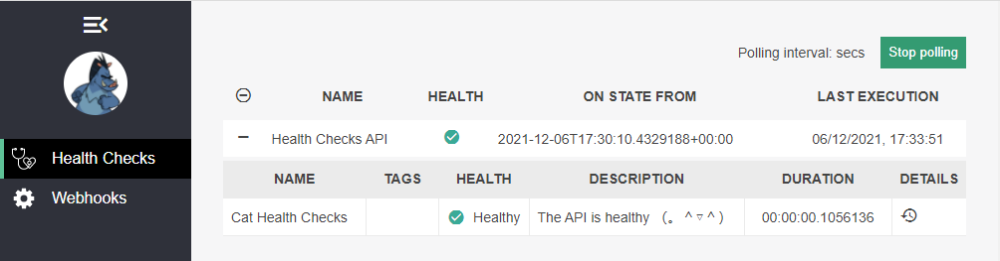

# Custom Health Checks for a .NET Core Server



Based on the following article:
* [Checking the Health of Your ASP.NET Core APIs](https://www.telerik.com/blogs/checking-health-aspnet-core-apis)

## Highlights
* Swagger UI
* Health Dashboard
* custom health check

## Requirements
* .NET Core 5.0

## Getting started
* clone repository
```bash
  $ dotnet restore
  $ dotnet build
  $ dotnet run
```
* open [Swagger UI](https://localhost:5001/swagger/index.html)
* open [Dashboard](https://localhost:5001/dashboard#/healthchecks)

## Further Work
* customise custom health check page

